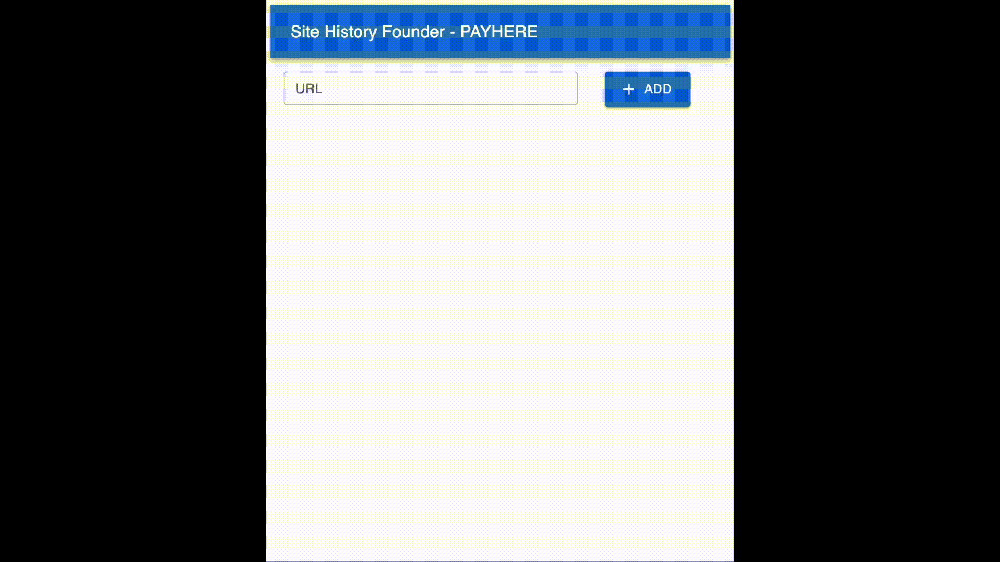

# SITE HISTORY FINDER 🔍


**<h3 align="center">A Simple Site History Finder 🗂️</h3>**


<p align="middle" >
  
</p>


<div align="middle">
  <a href="https://yeomgahui.github.io/payhere-assignment/">DEMO LINK</a>
</div>


# ⚙️ SKILL

**😎 아래 SKILLSET을 이용했어요**

- Creat React App
- TypeScript
- Webpack 
- MUI Library + Styled Component

# ❗ Requirement


- Node.js 18.x 이상
- NPM 패키지 매니저

# 🙌 Get Start!

**1. 저장소를 클론 합니다.**

```shell
$ git clone https://github.com/yeomgahui/payhere-assignment.git
```

**2. 프로젝트 디렉토리로 이동합니다.**

```shell
$ cd payhear-assignment
```

**3. 필요한 패키지를 설치합니다.**

```shell
$ npm i 
```

**4. 개발 서버를 실행합니다.**

```shell
$ npm run start
```

# 📬 Folder Directory
```bash
├── public/ # 정적 파일 (HTML 등)
├── src/ # 소스 코드
│ ├── api/ # API 관련 파일
│ ├── assets/ # 공통함수/상수 정의 파일
│ ├── components/ # 컴포넌트들
│ ├── layout/ # 레이아웃 컴포넌트들
│ ├── types/ # 타입 정의 파일
│ ├── views/ # 페이지 컴포넌트들
│ ├── App.tsx # 메인 애플리케이션 컴포넌트
│ ├── index.tsx # 애플리케이션 진입점
│ └── ... # 그 외 파일들
├── .gitignore # Git 무시 파일 목록
├── package.json # 프로젝트 설정 및 종속성
├── tsconfig.json # TypeScript 설정 파일
├── README.md # 프로젝트 설명 및 사용 방법
└── ... # 그외 파일들
```

---

## related

[** PAYHERE 과제 **](https://payhere.notion.site/2023-a56127648aa74e8abf3b7628ef447fef)

## 아쉬운 부분

- 테스트 코드 작성을 하지 못했어요. 
- Styled Component를 잘 활용하지 못했어요.

## Todo

- [] 테스트 코드 작성
- [] Loading Spinner 구현
